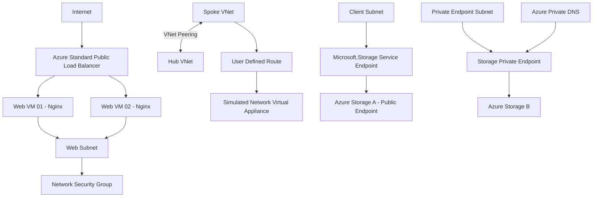

# Azure Secure Networking Capstone

A hands-on Microsoft Azure networking project demonstrating the design, implementation, validation, and troubleshooting of core Azure networking services.

This capstone was developed during my practical preparation for the **Microsoft Azure Administrator (AZ-104)** certification. Rather than focusing only on theoretical concepts, I deployed multiple Azure networking scenarios, validated their behavior, documented the results, and preserved the configurations for portfolio use.

---

## Project Objectives

The objectives of this project were to:

* Design Azure Virtual Networks and subnet segmentation
* Implement network security using NSGs and ASGs
* Configure private name resolution using Azure Private DNS
* Connect multiple VNets using VNet Peering
* Control network traffic using User Defined Routes
* Simulate traffic routing through a Network Virtual Appliance
* Validate Azure routing using Network Watcher
* Deploy a highly available web tier using Azure Load Balancer
* Compare Service Endpoints and Private Endpoints
* Secure Azure Storage using Private Link and Private DNS
* Validate configurations instead of only deploying resources
* Document Azure infrastructure and troubleshooting results

---

# Architecture Overview



---

# Lab 01 — Core Azure Network

The first lab focused on building the fundamental network and security architecture.

## Implemented

* Azure Virtual Network
* Multiple Azure Subnets
* Linux Virtual Machines
* Network Security Groups
* Application Security Groups
* NSG-to-Subnet association
* ASG membership for workload VMs
* Azure Private DNS Zone
* Virtual Network DNS Link
* Automatic DNS A-record registration

## Architecture

```text
Azure VNet
|
+-- Web Subnet
|   |
|   +-- Web VM
|       |
|       +-- ASG-Web
|
+-- Database Subnet
    |
    +-- Database VM
        |
        +-- ASG-DB

NSG
|
+-- Security rules between workload groups

Private DNS
|
+-- VNet Link
+-- Automatic A-record registration
```

## Key Learning

`NSG` controls whether network traffic is allowed or denied.

`ASG` provides logical grouping of Azure workloads without requiring individual IP addresses in security rules.

`Private DNS` provides internal name resolution between Azure resources.

Subnet segmentation provides a logical foundation for workload isolation and security controls.

---

# Lab 02 — VNet Peering and User Defined Routing

The second lab implemented a hub-and-spoke networking scenario and demonstrated how Azure route selection changes when a User Defined Route is applied.

## Implemented

* Hub Virtual Network
* Spoke Virtual Network
* Bidirectional VNet Peering
* Linux VM used as a simulated Network Virtual Appliance
* Azure NIC IP Forwarding
* Route Table
* User Defined Route
* Effective Routes
* Azure Network Watcher
* Next Hop diagnostics
* Longest Prefix Match validation

## Architecture

```text
Spoke VNet
    |
    | VNet Peering
    |
Hub VNet
    |
Simulated NVA

Spoke Subnet
    |
Route Table
    |
0.0.0.0/0
    |
Virtual Appliance
```

## Routing Validation

Before applying the UDR:

```text
Destination: 8.8.8.8
Next Hop: Internet
Route Source: Azure System Route
```

After applying the UDR:

```text
Destination: 8.8.8.8
Next Hop: Virtual Appliance
Route Source: User Defined Route
```

This demonstrated that the custom `0.0.0.0/0` route successfully changed the Azure routing decision for Internet-bound traffic.

Traffic toward the peered VNet continued to use the more specific VNet Peering route, demonstrating **Longest Prefix Match** behavior.

## Lab Limitation

The Linux VM was used to demonstrate Azure routing and NVA concepts.

Full production-style guest operating system forwarding, firewall functionality, and NAT were outside the scope of the temporary sandbox environment.

---

# Lab 03 — Azure Standard Public Load Balancer

The third lab focused on high availability and Layer 4 traffic distribution.

## Implemented

* Azure Virtual Network
* Web Subnet
* Two Ubuntu Virtual Machines
* Nginx Web Servers
* Network Security Group
* Standard Public Load Balancer
* Standard Public Frontend IP
* Backend Pool
* HTTP Health Probe
* TCP Port 80 Load Balancing Rule
* Backend configuration validation

## Architecture

```text
Internet
   |
   v
Public IP
   |
   v
Azure Standard Load Balancer
   |
   +-- Health Probe
   |
   +-----------------------+
   |                       |
   v                       v
Web VM 01              Web VM 02
Nginx                  Nginx
```

## Traffic Flow

```text
Client
  |
TCP/80
  |
Public Frontend IP
  |
Load Balancing Rule
  |
Backend Pool
  |
Healthy Backend VM
```

The Load Balancer uses health probes to determine whether backend instances are available to receive new connections.

This lab demonstrated how Azure can expose multiple private backend servers through a single public frontend.

---

# Lab 04 — Secure Azure PaaS Connectivity

The final networking lab compared two different methods for securely accessing Azure Storage:

* Service Endpoint
* Private Endpoint

---

## Service Endpoint Implementation

Implemented:

* Azure Storage Account
* Microsoft.Storage Service Endpoint
* VNet/Subnet integration
* Storage network restrictions

Architecture:

```text
Client Subnet
     |
     v
Service Endpoint
     |
     v
Azure Storage Public Endpoint
```

Characteristics:

* Storage retains its public endpoint
* No private IP is created for the Storage Account
* No Private Endpoint NIC is created
* Selected VNets and subnets can be trusted
* Storage firewall controls network access

---

## Private Endpoint Implementation

Implemented:

* Azure Storage Account
* Blob Private Endpoint
* Azure Private Link
* Private Endpoint Network Interface
* Private IP address
* Azure Private DNS Zone
* DNS A Record
* Virtual Network DNS Link
* Public network access restriction

Architecture:

```text
Azure Client
     |
     v
Private DNS
     |
     v
Private IP
     |
     v
Private Endpoint
     |
     v
Azure Private Link
     |
     v
Azure Storage
```

## Private DNS Resolution

For Azure Blob Storage:

```text
storageaccount.blob.core.windows.net
                |
                v
storageaccount.privatelink.blob.core.windows.net
                |
                v
Private Endpoint IP
```

The private endpoint provides an IP address inside the Azure Virtual Network.

Private DNS ensures that clients inside the linked VNet resolve the Azure Storage hostname to the private endpoint instead of the public service path.

---

# Service Endpoint vs Private Endpoint

| Feature                         | Service Endpoint | Private Endpoint  |
| ------------------------------- | ---------------- | ----------------- |
| Private IP for service          | No               | Yes               |
| NIC inside VNet                 | No               | Yes               |
| Uses Azure Private Link         | No               | Yes               |
| Public service endpoint remains | Yes              | Can be restricted |
| Private DNS normally required   | No               | Yes               |
| Subnet-based service access     | Yes              | No                |
| Strong private PaaS isolation   | Limited          | Yes               |

---

# Azure Services and Technologies Used

* Azure Virtual Network
* Azure Subnets
* Network Security Groups
* Application Security Groups
* Azure Virtual Machines
* Azure Private DNS
* Virtual Network Links
* VNet Peering
* Route Tables
* User Defined Routes
* Network Virtual Appliance concepts
* Azure Network Watcher
* Effective Routes
* Next Hop
* Azure Standard Load Balancer
* Public IP Addresses
* Backend Pools
* Health Probes
* Azure Storage
* Storage Network Rules
* Service Endpoints
* Private Endpoints
* Azure Private Link
* Bicep
* ARM Templates
* Nginx
* Linux

---

# Troubleshooting and Validation

A major goal of the project was to validate the infrastructure rather than only create Azure resources.

Validation activities included:

* Verified VNet Peering connectivity status
* Examined Effective Routes
* Compared routing behavior before and after applying a UDR
* Used Azure Network Watcher Next Hop
* Verified Longest Prefix Match behavior
* Validated NSG and ASG configuration
* Verified automatic Private DNS registration
* Validated Load Balancer backend configuration
* Configured and validated HTTP Health Probes
* Verified Private Endpoint private IP assignment
* Verified Private Endpoint NIC creation
* Verified Private DNS A records
* Verified Private DNS VNet integration
* Restricted public access to Azure Storage

---

# Infrastructure as Code

The temporary Azure lab environments provided infrastructure exports for several modules.

The repository includes exported infrastructure definitions such as:

```text
main.bicep
template.json
```

These files provide an Infrastructure-as-Code representation of deployed Azure resources and serve as a foundation for future reusable deployments.

The exported templates are preserved as lab artifacts and have not been presented as production-ready reusable modules.

---

# Repository Structure

```text
Azure-Secure-Networking-Capstone/
|
+-- README.md
|
+-- 01-core-network/
|   |
|   +-- screenshots/
|   +-- inventory/
|   +-- notes.txt
|
+-- 02-peering-routing/
|   |
|   +-- screenshots/
|   +-- exported-template/
|   |   |
|   |   +-- main.bicep
|   |   +-- template.json
|   |
|   +-- notes.txt
|
+-- 03-load-balancer/
|   |
|   +-- screenshots/
|   +-- exported-template/
|   |   |
|   |   +-- main.bicep
|   |   +-- template.json
|   |
|   +-- notes.txt
|
+-- 04-private-access/
    |
    +-- screenshots/
    +-- exported-template/
    |   |
    |   +-- main.bicep
    |   +-- template.json
    |
    +-- notes.txt
```

> Note: Lab 01 contains exported Azure inventory CSV files rather than a deployable ARM/Bicep template.

---

# Skills Demonstrated

* Azure Networking
* Azure Network Security
* Network Segmentation
* Routing and Traffic Engineering
* Hub-and-Spoke Architecture
* VNet Peering
* User Defined Routes
* Network Troubleshooting
* High Availability
* Load Balancing
* Azure DNS
* Private Networking
* PaaS Network Security
* Azure Storage Networking
* Azure Private Link
* Infrastructure as Code fundamentals
* Azure Portal Administration

---

# Project Context

This project was built during hands-on preparation for the:

**Microsoft Certified: Azure Administrator Associate (AZ-104)**

The Azure environments used for the project were temporary cloud sandbox environments.

Because individual sandbox sessions were time-limited, the project was intentionally divided into independent modules.

Each module was:

1. Designed
2. Deployed
3. Validated
4. Troubleshot
5. Documented
6. Preserved in GitHub

This approach allowed the complete architecture and technical learning outcomes to be preserved even after the temporary Azure resources expired.

---

# Key Takeaways

This project strengthened my understanding of how Azure networking components work together rather than treating each service as an isolated feature.

Key areas included:

* Understanding the difference between routing and traffic filtering
* Understanding Azure system routes and UDR precedence
* Using VNet Peering in hub-and-spoke designs
* Validating route selection using Network Watcher
* Understanding Load Balancer frontend, backend, probe, and rule relationships
* Comparing Service Endpoints with Private Endpoints
* Understanding the relationship between Private Endpoint, Private Link, and Private DNS
* Applying network security controls to Azure PaaS services

---

# Future Improvements

Future versions of this project can include:

* Refactoring exported Bicep into reusable modules
* Creating parameterized Bicep deployments
* Building the same architecture using Terraform
* Azure NAT Gateway integration
* Azure Firewall integration
* Centralized monitoring using Log Analytics
* Azure Monitor alerts
* Network Security Group flow analysis
* Automated infrastructure deployment
* GitHub Actions CI/CD for Infrastructure as Code
* Deployment into a persistent Azure subscription for end-to-end integration testing

---

## Author

**Sohrab Jalali**

IT Support & Network Engineer
Azure | Networking | IT Infrastructure | Cloud & DevOps
