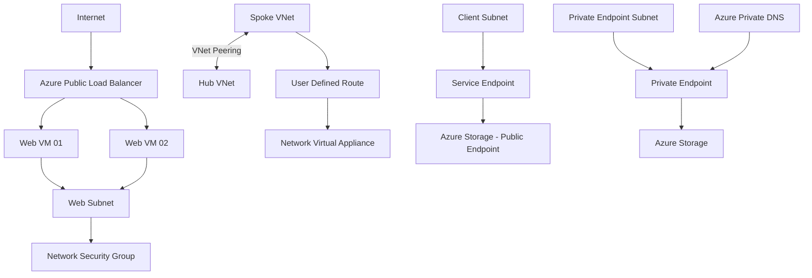

# Azure Secure Networking Capstone

A hands-on Microsoft Azure networking project built as part of my AZ-104 preparation.

This project demonstrates the design, implementation, validation, and troubleshooting of core Azure networking services using multiple practical lab environments.

## Project Objectives

The main goals of this project were to:

* Build secure Azure virtual networks and subnets
* Implement network segmentation using NSGs and ASGs
* Configure private name resolution with Azure Private DNS
* Connect multiple VNets using VNet Peering
* Control traffic paths using User Defined Routes
* Validate routing using Azure Network Watcher
* Deploy a highly available web tier using Azure Load Balancer
* Compare Azure Service Endpoints and Private Endpoints
* Secure Azure Storage using Private Link and Private DNS

---

## Architecture Overview



---

## Lab 01 — Core Azure Network

Implemented a segmented Azure network using:

* Azure Virtual Network
* Multiple Subnets
* Network Security Groups
* Application Security Groups
* Linux Virtual Machines
* Azure Private DNS
* Automatic DNS registration

### Key Concepts

`NSG` controls whether traffic is allowed or denied.

`ASG` provides logical grouping of workloads without managing individual IP addresses.

`Private DNS` provides internal name resolution for Azure resources.

---

## Lab 02 — VNet Peering and Routing

Implemented a hub-and-spoke networking scenario using:

* Hub VNet
* Spoke VNet
* VNet Peering
* Linux VM acting as a simulated Network Virtual Appliance
* IP Forwarding
* User Defined Routes
* Effective Routes
* Azure Network Watcher
* Next Hop

### Routing Validation

Before applying the custom route:

```text
Destination: 8.8.8.8
Next Hop: Internet
```

After applying the UDR:

```text
Destination: 8.8.8.8
Next Hop: Virtual Appliance
```

This demonstrated how a User Defined Route can override the Azure default system route.

---

## Lab 03 — Azure Load Balancer

Built a highly available web tier using:

* Two Ubuntu Web Servers
* Nginx
* Standard Public Load Balancer
* Public Frontend IP
* Backend Pool
* HTTP Health Probe
* TCP Port 80 Load Balancing Rule
* Network Security Group

### Traffic Flow

```text
Internet
   |
Public IP
   |
Azure Load Balancer
   |
Health Probe
   |
+----------+----------+
|                     |
Web VM 01          Web VM 02
```

The Azure Load Balancer sends new connections only to healthy backend servers.

---

## Lab 04 — Secure Azure PaaS Connectivity

Compared two Azure Storage connectivity models.

### Service Endpoint

```text
Client Subnet
     |
Service Endpoint
     |
Azure Storage Public Endpoint
```

Characteristics:

* No private IP is created
* No Private Endpoint NIC is created
* Azure Storage keeps its public endpoint
* Storage firewall can trust selected VNets and subnets

### Private Endpoint

```text
Client
  |
Private DNS
  |
Private IP
  |
Private Endpoint
  |
Azure Storage
```

Characteristics:

* Private IP created inside the VNet
* Network Interface created for the Private Endpoint
* Azure Private Link used
* Private DNS integration configured
* Public network access disabled

---

## Azure Services Used

* Azure Virtual Network
* Azure Subnets
* Network Security Groups
* Application Security Groups
* Azure Virtual Machines
* Azure Private DNS
* VNet Peering
* Route Tables
* User Defined Routes
* Azure Network Watcher
* Effective Routes
* Next Hop
* Azure Load Balancer
* Backend Pools
* Health Probes
* Azure Storage
* Service Endpoints
* Private Endpoints
* Azure Private Link

---

## Troubleshooting and Validation

The project included hands-on validation rather than configuration only.

Examples:

* Verified VNet Peering status
* Examined Effective Routes
* Used Network Watcher Next Hop
* Verified UDR route changes
* Validated Load Balancer backend health
* Tested HTTP connectivity through the Load Balancer
* Verified Private Endpoint private IP
* Verified Azure Private DNS records
* Confirmed Storage public network restrictions

---

## Repository Structure

```text
azure-secure-networking-capstone/
│
├── README.md
│
├── 01-core-network/
│   ├── screenshots/
│   └── notes.txt
│
├── 02-peering-routing/
│   ├── screenshots/
│   └── notes.txt
│
├── 03-load-balancer/
│   ├── screenshots/
│   └── notes.txt
│
└── 04-private-access/
    ├── screenshots/
    └── notes.txt
```

---

## Skills Demonstrated

`Azure Networking`
`Network Security`
`Routing`
`Hub-and-Spoke Architecture`
`Load Balancing`
`Private Connectivity`
`Azure DNS`
`Network Troubleshooting`
`PaaS Security`
`High Availability`

---

## Project Context

This project was created as part of hands-on preparation for the Microsoft Azure Administrator certification (`AZ-104`).

The lab environments were temporary Azure sandbox environments. Each module was therefore designed, deployed, validated, documented, and preserved independently.

The modular approach also demonstrates the ability to document infrastructure even when the original cloud resources are temporary.

---

## Next Improvements

Future versions of this project can include:

* Infrastructure as Code using Bicep
* Terraform deployment
* Azure NAT Gateway
* Azure Firewall
* Centralized monitoring
* Log Analytics
* Automated deployment using GitHub Actions
